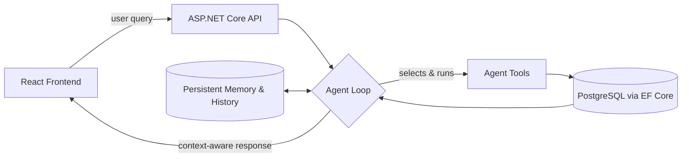

📍 Christchurch, New Zealand

 

### About

I'm a software developer focused on **backend and AI agent development** — turning user and
business needs into working systems with C#/.NET, APIs, databases, cloud services, and LLMs,
including designing and building LLM-driven agent workflows end to end. I like taking
ownership of a problem, working independently, and staying close to stakeholders while I build it.

*Also trained in visual design before moving into software — which is part of why this README isn't plain text.*

 

### 🔭 Currently

- 🤖 Building **[KONER Agent](https://green-meadow07a664610.3.azurestaticapps.net/)** — an LLM tool-calling agent that analyses time records and proposes schedule changes
- 🚀 Full-stack developer at **Microsoft Student Accelerator (MSA) 2026**, Auckland — shipping **[Footprint v2](https://footprint-v2-client.onrender.com/)**

 

### 🧰 Tech Stack

<table>
<tr><td><b>Backend</b></td><td>

</td></tr>
<tr><td><b>AI Engineering</b></td><td>

</td></tr>
<tr><td><b>Data</b></td><td>

</td></tr>
<tr><td><b>Frontend</b></td><td>

</td></tr>
<tr><td><b>Cloud &amp; DevOps</b></td><td>

</td></tr>
<tr><td><b>Tools</b></td><td>

</td></tr>
<tr><td><b>Methodologies</b></td><td>

</td></tr>
</table>

 

### 💡 Featured Projects

#### 🤖 KONER Agent — *Jul 2026 – Present*

An AI-powered time-management agent that uses **LLM-driven tool calling** to analyse a user's
time records, hold conversational context, and propose schedule changes that require the
user's approval before anything actually changes.

- Built the ASP.NET Core Web API and agent service, including the AI analysis endpoint that
  orchestrates LLM-driven analysis for the React frontend
- Integrated the Google Gemini API and implemented the **agent loop** — tool selection,
  execution, result processing, and context-aware response generation
- Designed reusable agent tools wired to **PostgreSQL via EF Core** for user-specific time-record retrieval
- Implemented **persistent user memory** and conversation history for continuity across sessions
- Containerised with Docker; GitHub Actions CI/CD deploys automatically to Azure on push

    
&nbsp;→&nbsp; [**Live demo**](https://green-meadow07a664610.3.azurestaticapps.net/)

 

<table>
<tr>
<td width="50%" valign="top">

**🌍 Footprint v2** — *Feb 2026 – Present*

Online travel community platform built during the Microsoft Student Accelerator 2026
internship — RESTful APIs, JWT authentication, RBAC, post sharing, city collections, and
gamification (points, leaderboards, achievement badges).

   

[**Live demo →**](https://footprint-v2-client.onrender.com/)

</td>
<td width="50%" valign="top">

**💼 Wingman Ltd** — *Jun 2025 – Nov 2025 (internship)*

Genetics data platform for dairy decision-making. Synced 20,000+ bull records from external
sources and shipped favourites, genetic-parameter comparison, and an email-based consultation
workflow.

   

Achievement: delivered the Phase 1 MVP — 6 independently built features

</td>
</tr>
</table>

 

### 📊 GitHub Activity

 

### 🎓 Certifications &amp; Education

Master of Applied Computing — Lincoln University, New Zealand (2024–2025)

 

---

📫 **kzhangdevnz@gmail.com** &nbsp;·&nbsp; [LinkedIn](https://www.linkedin.com/in/kezhang/) &nbsp;·&nbsp; Open to backend / AI agent developer roles in New Zealand

