I'm a software developer focused on **backend and AI agent development** — turning user and business needs into working systems with C#/.NET, APIs, databases, cloud services, and LLMs, including designing and building LLM-driven agent workflows end to end. I like taking ownership of a problem, working independently, and staying close to stakeholders while I build it.

<i>Also trained in visual design before moving into software — part of why this README isn't plain text.</i>

 

## [ 01 ] NOW

**BUILDING** &nbsp;`[ KONER_AGENT ]`&nbsp; — an LLM tool-calling agent that analyses time records and proposes schedule changes. [LIVE_DEMO ↗](https://green-meadow07a664610.3.azurestaticapps.net/)

**SHIPPING** &nbsp;`[ FOOTPRINT_V2 ]`&nbsp; — full-stack development at Microsoft Student Accelerator 2026, Auckland. [LIVE_DEMO ↗](https://footprint-v2-client.onrender.com/)

**EXPLORING** &nbsp; `[ AGENTIC_AI ]` `[ RAG ]` `[ TOOL_CALLING ]` `[ PERSISTENT_MEMORY ]`

 

## [ 02 ] SELECTED_WORK

<table>
<tr>
<td width="56%" valign="top">

<code>[ 01 // FEATURED ]</code>

**KONER Agent** &nbsp;<code>[ JUL 2026 — PRESENT ]</code>

An LLM tool-calling agent that reads a user's time records, holds conversational context, and proposes schedule changes that require the user's approval before anything actually changes.

- Agent loop on the Gemini API — tool selection, execution, and context-aware responses
- Reusable agent tools wired to **PostgreSQL via EF Core** for user-scoped time-record retrieval
- Persistent user memory and conversation history across sessions
- Dockerized; GitHub Actions deploys to Azure on every push

`[ ASP.NET Core ]` `[ Gemini API ]` `[ PostgreSQL ]` `[ EF Core ]` `[ Docker ]` `[ GitHub Actions ]`

**[LIVE_DEMO ↗](https://green-meadow07a664610.3.azurestaticapps.net/)**

</td>
<td width="44%" valign="top" align="center">

</td>
</tr>
</table>

 

<table>
<tr>
<td width="50%" valign="top">

<code>[ 02 ]</code>

**Footprint v2** &nbsp;<code>[ FEB 2026 — PRESENT ]</code>

Online travel community platform built during the Microsoft Student Accelerator 2026 internship — RESTful APIs, JWT authentication, RBAC, post sharing, city collections, and gamification (points, leaderboards, achievement badges).

`[ ASP.NET Core ]` `[ EF Core ]` `[ React ]` `[ TypeScript ]`

**[LIVE_DEMO ↗](https://footprint-v2-client.onrender.com/)**

</td>
<td width="50%" valign="top">

<code>[ 03 ]</code>

**Wingman Ltd** &nbsp;<code>[ JUN 2025 — NOV 2025 · INTERNSHIP ]</code>

Genetics data platform for dairy decision-making. Synced 20,000+ bull records from external sources and shipped favourites, genetic-parameter comparison, and an email-based consultation workflow.

`[ C# ]` `[ .NET ]` `[ SQL ]` `[ Git ]`

Shipped the Phase 1 MVP — 6 independently built features.

</td>
</tr>
</table>

 

## [ 03 ] ENGINEERING_STACK

| | |
|---|---|
| **LANGUAGES** | `[ C# ]` `[ SQL ]` |
| **BACKEND** | `[ .NET ]` `[ ASP.NET Core ]` `[ EF Core ]` `[ REST APIs ]` `[ JWT ]` |
| **AI ENGINEERING** | `[ LLM Integration ]` `[ AI Agents ]` `[ Tool Calling ]` `[ RAG ]` `[ Gemini API ]` `[ Azure OpenAI ]` |
| **DATA** | `[ PostgreSQL ]` `[ MySQL ]` `[ SQLite ]` |
| **CLOUD & DEVOPS** | `[ Azure ]` `[ Docker ]` `[ GitHub Actions ]` |

ALSO — `[ React ]` `[ TypeScript ]` `[ Next.js ]` `[ Tailwind CSS ]` &nbsp;/&nbsp; `[ Git ]` `[ GitHub ]` `[ Postman ]` `[ Linux ]` `[ Swagger ]` `[ Claude Code ]` `[ Cursor ]` `[ GitHub Copilot ]` &nbsp;/&nbsp; `[ Agile ]` `[ Scrum ]` `[ Jira ]`

 

## [ 04 ] BUILD_LOG

| | |
|---|---|
| `[ JUL 2026 ]` | KONER — agent loop, tool calling & persistent memory on Gemini + PostgreSQL |
| `[ JUL 2026 ]` | KONER — Dockerized; GitHub Actions CI/CD to Azure |
| `[ FEB 2026 ]` | Footprint v2 — RESTful APIs, JWT auth, RBAC & gamification (MSA 2026, Auckland) |
| `[ NOV 2025 ]` | Wingman — shipped the Phase 1 MVP, 6 independently built features |
| `[ JUN 2025 ]` | Wingman — synced 20,000+ bull records; built comparison & consultation workflow |

 

## [ 05 ] CREDENTIALS

`[ AZ-900 ]` Azure Fundamentals &nbsp;·&nbsp; `[ AI-900 ]` Azure AI Fundamentals &nbsp;·&nbsp; `[ CLF-C02 ]` AWS Certified Cloud Practitioner

Master of Applied Computing — Lincoln University, New Zealand (2024–2025)

 

## [ 06 ] CONTACT

Christchurch, New Zealand &nbsp;·&nbsp; open work rights (NZ) &nbsp;·&nbsp; open to backend / AI agent developer roles

[GITHUB](https://github.com/KeZhang-dev) &nbsp;·&nbsp; [LINKEDIN](https://www.linkedin.com/in/kezhang/) &nbsp;·&nbsp; [EMAIL](mailto:kzhangdevnz@gmail.com)
