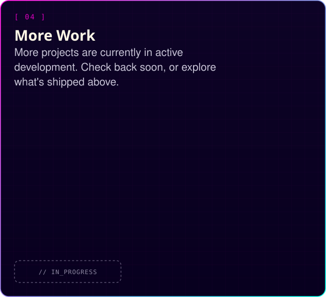

I'm a software developer focused on **backend and AI agent development** — turning user and business needs into working systems with C#/.NET, APIs, databases, cloud services, and LLMs, including designing and building LLM-driven agent workflows end to end. I like taking ownership of a problem, working independently, and staying close to stakeholders while I build it.

 &nbsp;  &nbsp; 

 

## ⚡ SELECTED WORK

<table>
<tr>
<td width="50%" valign="top">

</td>
<td width="50%" valign="top">

</td>
</tr>
<tr>
<td width="50%" valign="top">

</td>
<td width="50%" valign="top">

</td>
</tr>
</table>

 

## 🛠️  ENGINEERING STACK

 

## 🏆 CREDENTIALS

🏆&nbsp;  `[ AZ-900 ]` Azure Fundamentals &nbsp;·&nbsp;  `[ AI-900 ]` Azure AI Fundamentals &nbsp;·&nbsp;  `[ CLF-C02 ]` AWS Certified Cloud Practitioner

🎓&nbsp; Master of Applied Computing — Lincoln University, New Zealand (2024–2025)

 

