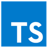
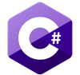
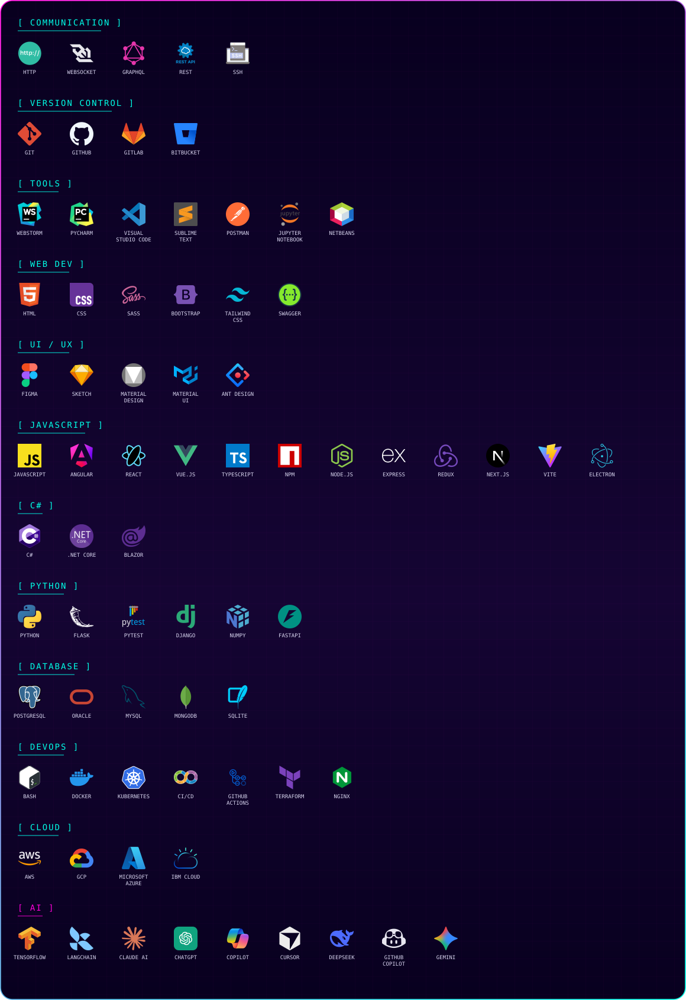

I'm a software developer focused on **backend and AI agent development** — turning user and business needs into working systems with C#/.NET, APIs, databases, cloud services, and LLMs, including designing and building LLM-driven agent workflows end to end. I like taking ownership of a problem, working independently, and staying close to stakeholders while I build it.

 &nbsp;  &nbsp; 

 

## ⚡ SELECTED WORK

<table>
<tr>
<td width="50%" valign="top">

<code>[ 01 ]</code>

**🤖 KONER Agent**

LLM tool-calling agent that reads a user's time records, holds context, and proposes schedule changes for approval.

     

ASP.NET Core · Gemini API · PostgreSQL · EF Core · Docker · GitHub Actions

</td>
<td width="50%" valign="top">

<code>[ 02 ]</code>

**🌍 Footprint v2**

Travel community platform from the Microsoft Student Accelerator 2026 internship — RESTful APIs, JWT auth, RBAC, gamification.

   

ASP.NET Core · EF Core · React · TypeScript

</td>
</tr>
<tr>
<td width="50%" valign="top">

<code>[ 03 ]</code>

**🧬 Wingman Ltd**

Genetics data platform for dairy decisions — synced 20,000+ bull records; shipped the Phase 1 MVP (6 features).

   

C# · .NET · SQL · Git

</td>
<td width="50%" valign="top">

<code>[ 04 ]</code>

**🧩 More Work**

More projects are in active development — this slot updates soon.

  

<code>[ // IN_PROGRESS ]</code>

</td>
</tr>
</table>

 

## 🛠️  ENGINEERING STACK

 

## 🏆 CREDENTIALS

🏆&nbsp;  `[ AZ-900 ]` Azure Fundamentals &nbsp;·&nbsp;  `[ AI-900 ]` Azure AI Fundamentals &nbsp;·&nbsp;  `[ CLF-C02 ]` AWS Certified Cloud Practitioner

🎓&nbsp; Master of Applied Computing — Lincoln University, New Zealand (2024–2025)

 

[GITHUB](https://github.com/KeZhang-dev) &nbsp;·&nbsp; [LINKEDIN](https://www.linkedin.com/in/kezhang/) &nbsp;·&nbsp; [EMAIL](mailto:kzhangdevnz@gmail.com)

